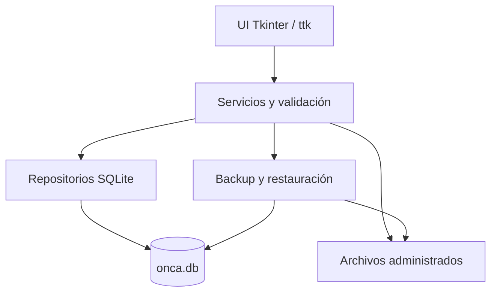

# Arquitectura

## Visión general

ONCA es una aplicación local de escritorio. No tiene servidor, API web, login ni
sincronización remota. La UI trabaja en el hilo principal de Tkinter; SQLite y
archivos residen en un directorio del usuario.

## Capas

### UI

`ui.py`, `activity_form.py`, `form_widgets.py` y `date_picker.py` presentan
formularios, tablas, selección y mensajes. No ejecutan SQL. La identidad de
selección no depende de posiciones en una lista. Los widgets solo se usan desde Tk.

### Servicios

`student_service.py`, `payment_service.py`, `activity_service.py` y
`certificate_service.py` validan, coordinan operaciones y llaman repositorios.
`validation.py` concentra reglas comunes; `FieldValidationError` identifica
campos para feedback inline sin acoplar servicios a widgets.

### Persistencia

Los módulos `*_repository.py` contienen SQL parametrizado. `database.py`
abre conexiones con FK, commit/rollback y cierre del handle. Un lock de aplicación
coordina operaciones de datos entre hilos/procesos de ONCA. No se habilitó WAL.

### Modelos

`models.py` define `StudentDraft`. El resto de estados usa diccionarios y
filas SQL en la capa de repositorios. Los servicios entregan importes Decimal
al cruzar hacia la presentación. No hay ORM ni inferencia de identidad por nombre.

### Migraciones

Schema inicial en `schema.sql`; versión vigente mediante
`CURRENT_SCHEMA_VERSION` y `PRAGMA user_version`, actualmente 4.
Versiones consecutivas se aplican mediante savepoints, con rollback del upgrade.
Instalaciones anteriores se respaldan/verifican primero. Versiones futuras o
estructuras incompatibles se rechazan, sin eliminar datos para forzar compatibilidad.

- v1: adopción del esquema original, columnas y FK.
- v2: índices medidos y guards de montos/participaciones.
- v3: verificación médica explícita, inicialmente falsa.
- v4: preservación de Nombre/Apellidos; un antiguo name único pasa íntegro a
  first_name y last_name vacío, sin heurísticas.

Las bases nuevas aplican el mismo recorrido; no contienen semillas de alumnos.
Catálogos de cintas/estados son constantes de código.

### Archivos

`paths.py` distingue recursos fuente/bundle de datos de usuario.
`certificates.py` valida y copia adjuntos a rutas UUID relativas administradas.
Se rechazan traversal, enlaces y nombres reservados; la validación de firma no
sustituye antimalware. Nuevos PNG/PDF no usan nombres de alumnos en sus filenames.

### Backups

`backups.py` usa la API online de SQLite y coordina adjuntos mediante locks.
Incluye manifest/checksums, verifica referencias y normaliza rutas absolutas
históricas solo en la copia. Restore valida staging y publica una carpeta nueva.

## Flujo típico

Crear alumno: UI → validate_student → save_student_to_db → save_student_record
→ transacción SQLite → recarga de tabla por ID. Guardar datos generales no crea pagos.

Un adjunto se copia/valida antes de registrar la referencia. Si SQL falla, se
elimina únicamente la copia nueva. Un edit individual de actividad compartida
usa copia antes de escribir para conservar a los demás participantes.

## Identidad de alumnos

`student_id` identifica alumnos y relaciones. Homónimos son independientes.
`first_name` y `last_name` se almacenan separados; `display_name()` compone
el nombre visual sin marcadores para apellidos ausentes. Búsqueda del servicio
filtra el nombre visual con casefold en una consulta; no hay buscador visual añadido.

## Manejo de fechas

`InlineDateEntry` y `DatePicker` comparten Año/Mes/Día, apertura por clic,
botón/F4 y salida ISO YYYY-MM-DD. `parse_date_field()` centraliza reglas:
nacimiento/certificado no futuros, actividad/pago con pasado/futuro.
Nacimiento es opcional; verificar o adjuntar exige fecha de certificado válida.
La entrada manual sigue validándose. No se inventa una fecha por dejarla vacía.

## Manejo de dinero

`parse_amount()` produce Decimal con hasta dos decimales y límite de monto.
`activity_amounts()` valida costo/pagado; restante es la resta exacta y nunca
puede ser negativo. Sobrepago bloquea guardado con mensaje inline.
Estado indica participación/asistencia, no saldo de pago.

Se conserva SQLite REAL por compatibilidad: parámetros se enlazan como texto
decimal y servicios convierten lecturas mediante su representación textual.
No se suma/resta dinero con floats o SQL. Anomalías históricas se conservan y
requieren corrección al editar; no se recortan por una migración silenciosa.

## Certificado médico

Archivo y verificación son independientes. Adjuntar no marca verificado.
El clic en la casilla usa una transacción por ID, con fecha explícita al marcar.
Sin archivo puede existir metadato con referencia vacía; el primer adjunto lo
completa. Desmarcar conserva archivos/fecha. `medical_indicator()` compone ✓/vacío.
Ante fallo SQL la UI restaura el estado; el autosave no guarda otros campos
pendientes, cambia la pestaña ni dispara al cargar programáticamente la variable.

## Actividades

Tabla ttk con fecha/tipo/lugar/costo/pagado/estado; título, notas y saldo en detalle.
Selección por `student_activity_id`. Historial mixto con ORDER BY fecha DESC e
ID DESC como desempate; próxima actividad del listado principal tiene regla propia.
Listados agregados evitan consultas por cada alumno. Lugar sigue textual y offline.

## Almacenamiento local

Windows: `%LOCALAPPDATA%/OncaAlumnos`. Recursos del EXE se leen desde el bundle;
nunca se escriben datos en Program Files o junto al ejecutable por defecto.
`ONCA_DATA_DIR` permite otra ruta absoluta escribible antes de arrancar.
El primer inicio crea certificados/backups/logs y cinco tablas de negocio vacías.

## Backups y recuperación

Backup diario al iniciar, manual y previo a migraciones. Si falta un adjunto no se
acepta un respaldo incompleto. Fallo de backup diario en schema actual se informa
sin bloquear la UI; fallo de respaldo previo impide migrar. Restauración nunca
sobrescribe la instalación activa. Más detalle en [datos](data-and-privacy.md).

## Manejo de errores y logging

Errores de campos: inline. Errores técnicos: mensaje genérico y evento registrado.
`logging_config.py` permite solo eventos fijos/clases de excepción, sin datos,
rutas, mensajes SQL ni traceback. Rotación limitada de logs; backups no incluyen logs.
Los workers de archivos entregan resultados mediante callbacks al hilo Tk.

## Dependencias externas y empaquetado

Runtime: biblioteca estándar, Tcl/Tk y SQLite. No Pillow, tkcalendar ni mapa.
PyInstaller y sus dependencias solo sirven para build. `OncaAlumnos.spec`
incluye únicamente schema y SQL 002/003/004, no tests, bases, assets o directorios
de datos. Metadata numérica Windows deriva de la versión SemVer/RC.
Avisos originales acompañan la futura distribución. [Licencias](dependencies-and-licenses.md).

La separación por servicios se conserva; UI grande, listados completos y
configuración global de rutas son límites actuales, sin otro framework añadido.
